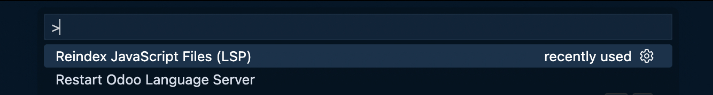
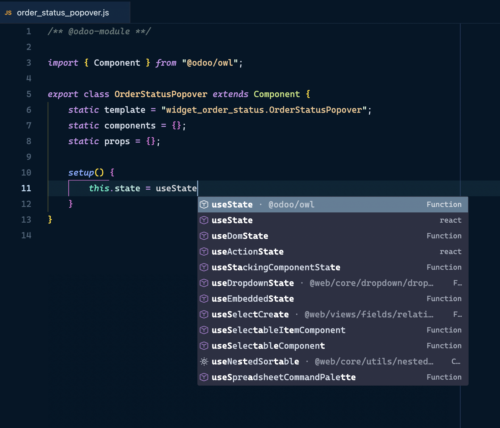
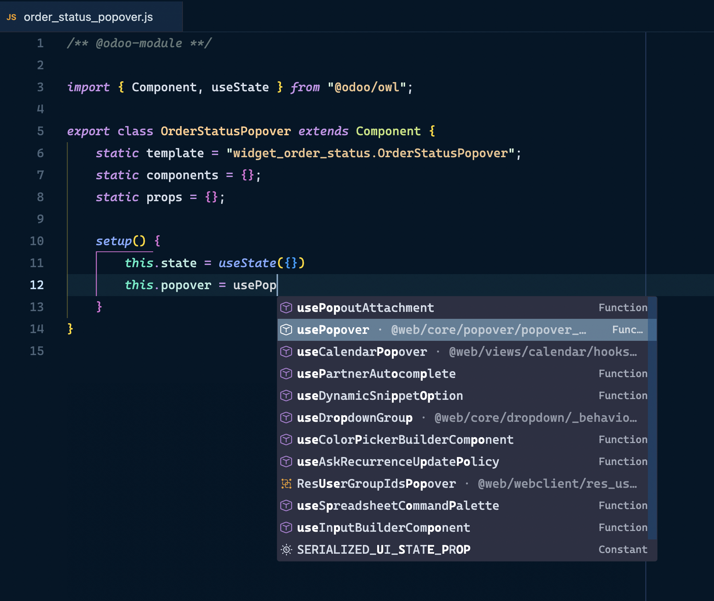
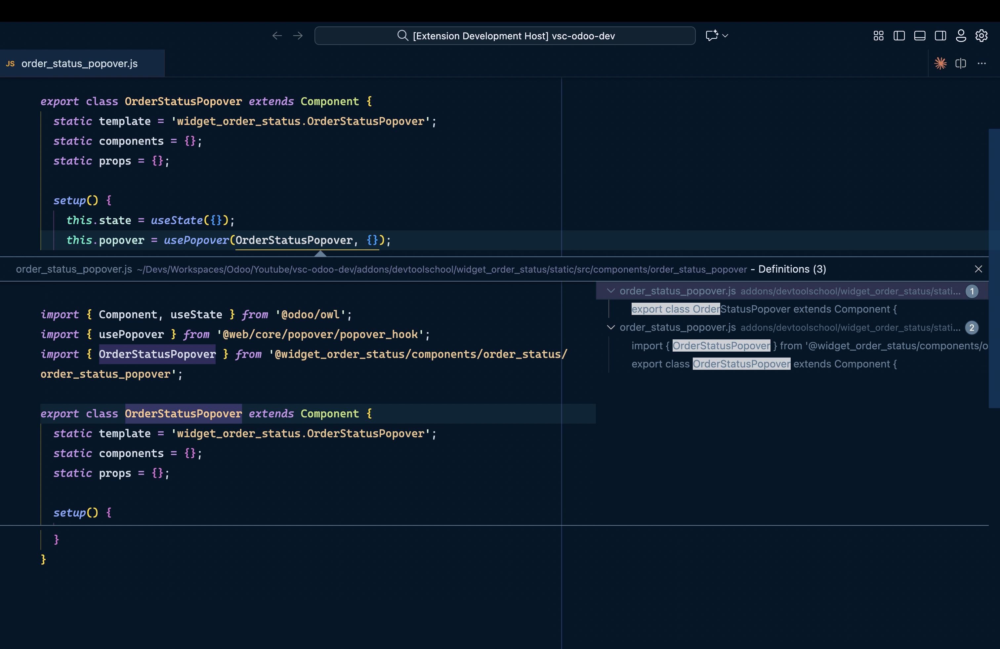

# LSP and Language Features

Odoo Shortcuts includes a proprietary Language Server (LSP) that provides intelligent autocomplete, code navigation, and static analysis for JavaScript/TypeScript in the Odoo context.

| OWL LSP Features |
|:---:|
|  |
|  |
|  |
|  |

## 🚀 LSP Features

### Intelligent Autocomplete

The LSP provides context-aware autocomplete for:

- **OWL Components** - Available classes and components
- **Services** - Odoo registry services
- **Imports** - Import navigation and autocomplete
- **Templates** - QWeb template references
- **Core symbols** - Odoo classes and functions

### Code Navigation

- **Go to Definition** (`F12`) - Jump to definition
- **Peek Definition** (`Alt+F12`) - Show definition inline
- **Find All References** (`Shift+F12`) - Find all references
- **Symbol Search** (`Ctrl+T`) - Search symbols by name

### Real-time Analysis

- **Diagnostics** - Errors and warnings while you write
- **Reindexing** - Automatic index updates
- **Indexing Progress** - Progress bar in status bar

## ⚙️ Configuration

### Odoo Server Paths

The LSP needs to know where Odoo files are to index them:

```json
{
  "odooShortcuts.odooServerPaths": [
    "/home/user/odoo",
    "/home/user/enterprise"
  ]
}
```

### LSP Activation

The LSP starts automatically when you open JavaScript/TypeScript files. It activates for:

- `.js` files with `/** @odoo-module **/`
- `.ts` files
- Files in `static/src/` directories

## 📊 LSP Commands

### Restart LSP

Restart the language server (useful if there are issues):

**Command:** `Odoo Shortcuts: Restart OWL/JS Language Server`

### Reindex JavaScript

Force reindexing of all JavaScript files:

**Command:** `Odoo Shortcuts: Reindex JavaScript Files (LSP)`

Shows a notification with progress and result.

### Auto Import

When you use an unimported symbol, the LSP can suggest automatic imports.

## 🎯 Usage Examples

### Component Autocomplete


```javascript
/** @odoo-module **/
import { Component } from "@odoo/owl";

export class MyComponent extends Component {
    setup() {
        // Type "use" and press Ctrl+Space
        this.state = useState({});  // ← Autocompletes useState
    }
}
```

### Navigation to Definitions


```javascript
import { Dialog } from "@web/core/dialog/dialog";

// Ctrl+Click on "Dialog" to go to its definition
```

### Auto Import

```javascript
/** @odoo-module **/

// Type "Component" without importing it
class MyComponent extends Component {
    // LSP will suggest: import { Component } from "@odoo/owl";
}
```

## 📈 Progress Bar

When the LSP is indexing files, you'll see in the status bar:

```
🔄 Indexing JS: 45%
```

This indicates the server is scanning your codebase. Once completed, all features will be available.

## 🐛 Troubleshooting

### LSP doesn't start

1. Verify you have JavaScript/TypeScript files open
2. Check server path in configurations
3. Restart LSP manually

### Autocomplete doesn't work

1. Wait for initial indexing to finish
2. Reindex files manually
3. Verify files have `/** @odoo-module **/`

### Slow performance

If you have a very large codebase:

1. Reduce paths in `odooServerPaths` to only what's necessary
2. Exclude directories in `.gitignore`
3. Restart VS Code if necessary

### Connection errors

If you see connection errors to the LSP:

1. Close and reopen VS Code
2. Restart the LSP
3. Verify no other process is using the port

## 🔧 Architecture

The LSP is divided into two parts:

### Client (VS Code Extension)

- Manages communication with the editor
- Provides commands and UI
- Receives notifications from the server

### Server (Node.js)

- Analyzes JavaScript/TypeScript code
- Maintains a symbol index
- Provides autocomplete and navigation
- Runs in the background

## 📚 Supported Symbols

The LSP indexes and provides information about:

- OWL framework: Component, hooks (`useState`, `useRef`, `useEffect`), lifecycle methods
- Odoo Core: `registry`, `services`, common patterns
- Custom Addons: All your exported symbols
- 40+ included Type Definitions

## 🎨 Customization

The LSP behavior automatically adjusts based on:

- Detected Odoo version
- Project structure
- Path configuration

No additional manual configuration required.

---

**Next:** [CodeLens](./codelens.md)
